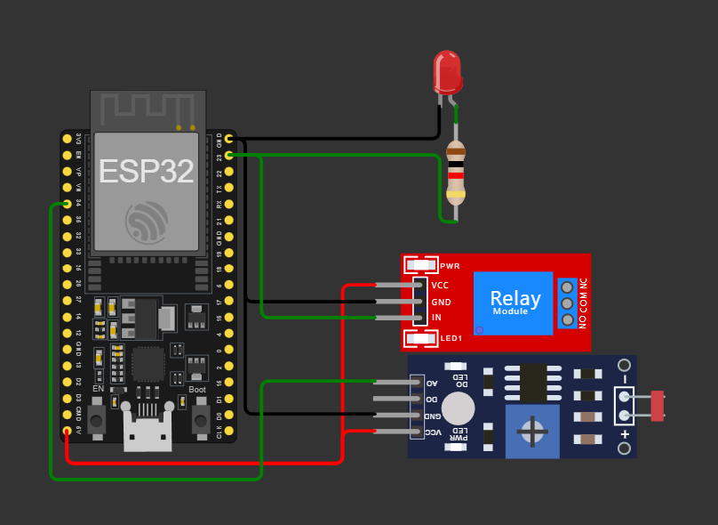
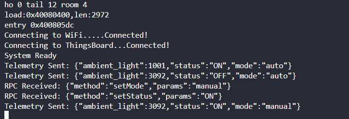
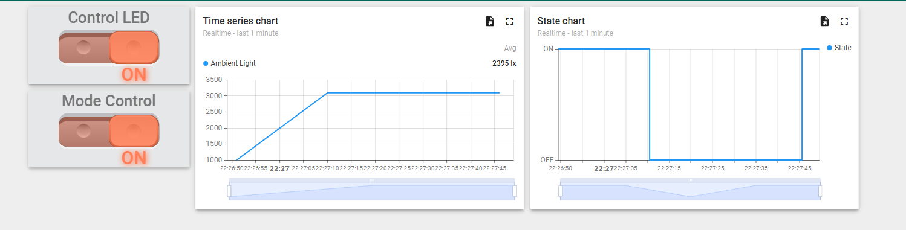

# Smart-Streetlight-ThingsBoard-Auto-Manual_ESP32

A smart streetlight system using ESP32 with dual control modes: **automatic (sensor-based)** and **manual (via dashboard switch)**. The system is integrated with **ThingsBoard** to allow real-time monitoring and remote control.

---

## 🌟 Features

- 🔦 **Automatic Mode**: Uses an LDR (light sensor) to automatically turn the light ON/OFF based on ambient brightness.
- 🧠 **Manual Mode**: Allows user to override automation and control the light manually through a ThingsBoard dashboard switch.
- 🌐 **Cloud Integration**: Uses ThingsBoard platform for telemetry, control widgets, and state visualization.

---

## 📋 Project Workflow

### 1. Connect Device to ThingsBoard

- Create a new device (e.g., `Streetlight-ESP32`) on ThingsBoard.
- Copy the device **access token**.
- On the ESP32:
  - Read LDR sensor data (`analogRead`).
  - If ambient light < threshold → Consider it "night".
  - Send telemetry data using MQTT or HTTP:

    ```json
    {
      "ambient_light": 150,
      "status": "ON",
      "mode": "auto"
    }
    ```

---

### 2. Remote ON/OFF Control

- Create a switch widget named **Streetlight Control**.
- ESP32 subscribes to RPC commands:
  
  ```json
  { "method": "setStatus", "params": "ON" }
  ```

- When `params` is "OFF", ESP32 turns off the light.
- After change, device sends back updated status.

---

### 3. Dual Mode: Auto / Manual

- A second switch widget on dashboard manages control mode:

  - `auto`: LDR controls the light.
  - `manual`: user toggles the streetlight manually.
  
- ESP32 logic:

  - If mode = `auto` → follow sensor.
  - If mode = `manual` → wait for RPC command from dashboard to toggle light.

---

## 🖥️ Dashboard Layout

- **Button 1: Mode Control**
  - Switches between `"auto"` and `"manual"` modes.
  - Attribute key: `mode`
  - RPC method: `setMode`
  
- **Button 2: Streetlight Control**
  - ON/OFF switch (only active when in manual mode).
  - RPC method: `setStatus`

- **State Chart Widget**
  - Shows light status over time (`status`: ON/OFF)

---

## 🧩 Circuit Diagram



## 🖵 Terminal Output Example



## 📈 System Diagram



---

## 📦 Hardware Used

| Component        | Quantity |
|------------------|----------|
| ESP32 Dev Board  | 1        |
| LDR Sensor       | 1        |
| 10k Resistor     | 1        |
| Relay Module     | 1        |
| LED / Lamp       | 1        |
| Jumper Wires     | -        |

---

## ☁️ Platform

- [ThingsBoard Cloud](https://thingsboard.cloud/) (Free tier supported)
- Protocol: MQTT or HTTP
